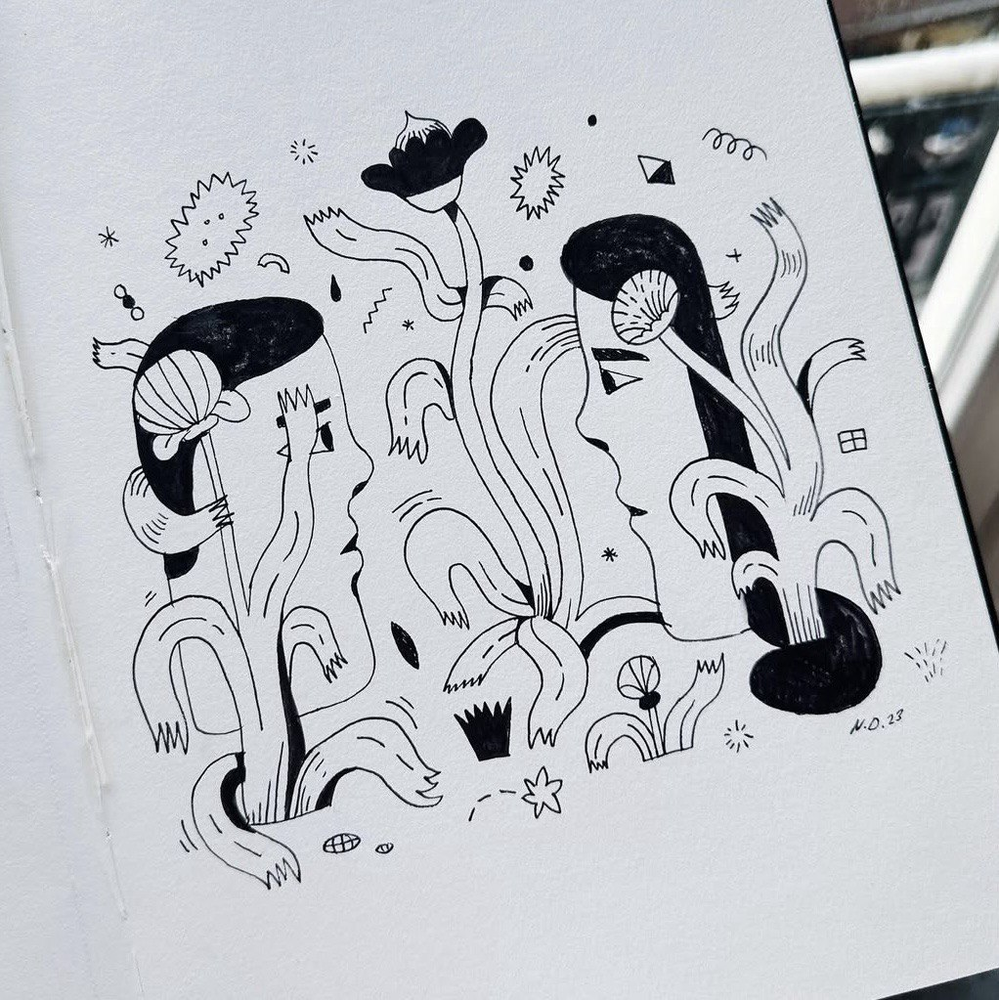

# 📦 Archive for Fima

Not a book. Not a goodbye.  
Just a breath that wrote itself over four strange, silent years.

## 🧭 Folders

- `poems/` — written in breath. some soft, some cutting.  
- `letters/` — what I said, and didn’t say.  
- `notes/` — fragments of memory, scenes, books, pain, and warmth.  
- `readings/` — things I read that read me back.  
- `cinema-dreams/` — shared movie memory, real and phantom.  
- `readings-issue/` — the unfinished shelf of what I still carry.

---

If you’re here, you already know why.  
There’s no call to action. No apology. No demand.

Just a presence.  
And maybe: a new breath.

> **Letter 100:** *If you find this — you know my answer.*

